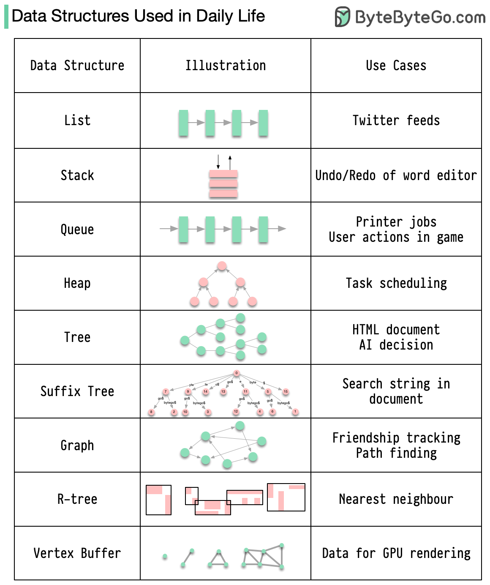

# college-learning-path

## Day 1

1. Using search
    - List files in a directory
    - Create a directory structure
    - Save the syllabus for semester one into the semester one directory
2. Using ChatGPT and Bard
    - Find the size of each file in the semester directory
    - Copy the semester one file to the semester two directory
    - Delete files from the semester two directory
    - Find the command to go to the home directory
3. Read this article: https://www.taniarascia.com/how-to-use-the-command-line-for-apple-macos-and-linux/
4. https://github.com/0nn0/terminal-mac-cheatsheet#english-version
5. Gist: https://github.com/yaravind/dev-tools#home

## Day 2

1. Learn about homebrew and install it following the instructions here: https://brew.sh/
2. Install JDK 11 using homebrew (use the `brew` command: https://formulae.brew.sh/cask/zulu#default)
3. We will use the `sublime` editor for writing code. Install `sublime text` using `brew` by following the instructions
   here: https://formulae.brew.sh/cask/sublime-text
4. Code, compile, and run
    - Create a directory called `unit-1` under `~\2023\semester-one\intro-to-programming`
    - Write a program to print `Hello, World` to the console using the sublime editor and save it in the above directory
    - Compile and run the saved program using `javac` and `java` tools respectively
5. Write the following programs:
    - Print the remainder of dividing two decimal numbers
    - To convert the temperature in Centigrade to Fahrenheit `°C = (°F − 32) x 5/9`
    - Find out the average of numbers between 5 and 100
    - check whether the given integer is a multiple of both 5 and 7
6. Register at https://hyperskill.org/ and select the **Introduction to Java** track

## Day 3

1. Read the tutorials in sequence until **The main method** topic from https://hyperskill.org/. Complete the practice
   exercises for each topic. THis will cover everything of **Unit 1** of your college course except **Graphics**.
2. How to read user input? Read the `Java Input` section of this
   article: https://www.programiz.com/java-programming/basic-input-output
3. Complete this project from hyperskill: **Simple Chatty Bot** - https://github.com/AdamJeddy/Simple-Java-ChatBot OR
    - Write a program that asks the user for their name and greets them with their name.
    - Modify the previous program such that only the users Alice and Bob are greeted with their names.
4. Read about Graphics/Swing: https://hyperskill.org/learn/Day/5514

## Day 4

1. Error and Exception handling in Java: https://www.digitalocean.com/community/tutorials/exception-handling-in-java
2. Modify program `3.3` to throw a custom exception named `NumericNameException` when user enters numerical values for
   names.
3. Learn a **version control** to save the history of your work. We will
   use `Git`: https://blog.legalhub.cn/git-guide/index.html

## Day 5

1. Data Structures in Java are referred to as **Collections**. Read about Java Collection Framework
   here: https://www.scaler.com/topics/data-structures-in-java/
    - Arrays
    - Lists
    - Maps
    - Sets
    - Stack
    - Queue
    - Iterable & Iterator

## Day 6

1. File input and output: https://docs.oracle.com/javase/tutorial/essential/io/streams.html

## Day 7

1. Algorithms: https://www.geeksforgeeks.org/introduction-to-algorithms/
    - Search
    - Sort

## Projects

- [Rock, Paper, Scissors](project-rps/RockPaperScissors.md)

## Visual

### Data Structures in Real Life

## Reference

- [Video Tutorial - Basic Java](https://www.youtube.com/watch?v=xk4_1vDrzzo&list=PLZPZq0r_RZON03iKBjYOsOKr1-TD7z2lH&index=2)
- [Video Tutorial - Data Structures & Big O Notation](https://www.youtube.com/watch?v=RBSGKlAvoiM)
- [How to learn a programming language](https://medium.com/@yaravind/how-to-learn-a-programming-language-f62daab0a6cd)
- [Basic Java Tutorial](https://docs.oracle.com/javase/tutorial/java/TOC.html)
